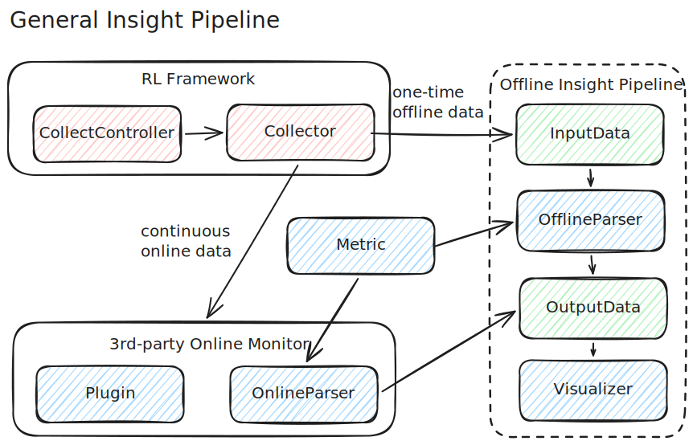

# RL-Insight: Provide performance insight capabilities for RL frameworks.
<div align="center">

[](https://deepwiki.com/verl-project/rl-insight)
[](https://github.com/verl-project/rl-insight/stargazers)
[](https://twitter.com/verl_project)
[](https://rl-insight.readthedocs.io/en/latest/)

</div>

RL-Insight Recipe provides offline performance insight capabilities for RL training frameworks. It defines a general pipeline for parsing profiling data and rendering timeline, heatmap, and memory-analysis views.

<div align="center">
 
</div>

## Key Features

**Offline Analysis**
- **Timeline visualization** — interactive HTML Gantt charts for per-rank event timelines across RL training phases, with parallel multi-rank parsing for MSTX, Torch Profiler, and NVTX data sources. PNG export also supported.
- **MoE Expert Load Heatmap** — GMM-clustered heatmaps to visualize expert load distribution in Mixture-of-Experts models, helping identify load imbalance across experts and layers.

## Installation

Python >= 3.10 required.

```bash
pip install rl-insight
```

For the latest unreleased features, install from source:

```bash
git clone https://github.com/verl-project/rl-insight.git
cd rl-insight
pip install -r requirements.txt
pip install -e .
```

## Quickstart

### Timeline Visualization

Parse MSTX, Torch Profiler, or NVTX data and generate an interactive HTML timeline:

```bash
# MSTX
python -m recipe.main \
    input.path=<profiling_data_path> \
    timeline.parser.type=mstx \
    output.path=<output_path>

# Torch Profiler
python -m recipe.main \
    input.path=<torch_data_path> \
    timeline.parser.type=torch \
    output.path=<output_path>

# NVTX
python -m recipe.main \
    input.path=<nvtx_data_path> \
    timeline.parser.type=nvtx \
    output.path=<output_path>
```

Switch visualizer type for PNG output:

```bash
timeline.visualizer.type=html    # interactive timeline (default)
timeline.visualizer.type=png     # static PNG export
```

Convenience scripts are available in `examples/recipe/`:

```bash
bash examples/recipe/mstx_exec.sh
bash examples/recipe/torch_profiler_exec.sh
bash examples/recipe/nvtx_exec.sh
```

### MoE Expert Load Heatmap

Visualize expert load distribution in Mixture-of-Experts models:

```bash
bash examples/recipe/gmm_exec.sh
```

Or with full CLI control:

```bash
python -m recipe.main \
    input.path=<gmm_data_path> \
    output.path=<output_path> \
    heatmap.parser.type=gmm \
    heatmap.visualizer.type=gmm_heatmap \
    heatmap.visualizer.gmm_per_layer=3
```

## Documentation

- [Architecture & Design](../docs/recipe/overview/architecture.md)
- [Offline Timeline Quickstart](../docs/recipe/overview/RL_Timeline_quickstart.md)
- [GMM Heatmap Quickstart](../docs/recipe/overview/gmm_heatmap_quickstart.md)
- [Memory Parser Guide](../docs/recipe/developer_guides/memory_parser_guide.md)
- [Extension Guide](../docs/recipe/developer_guides/extending_guide.md)

## Contribution Guide

See [CONTRIBUTING.md](../CONTRIBUTING.md).
